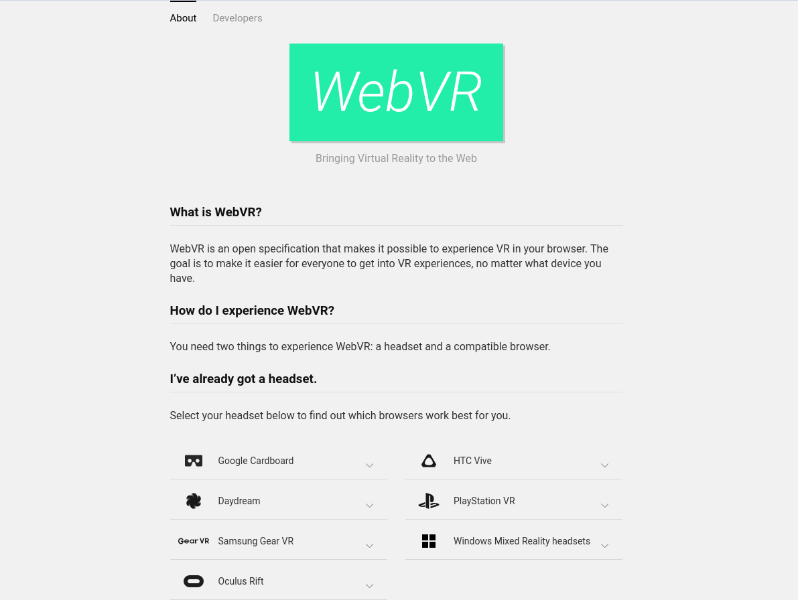

# A-Frame
## Create VR experiences in your browser. Easily.

_by [@anxolerd](https://github.com/anxolerd)_

-----

## Browsers become tiny operating systems

- [Geolocation API](https://www.w3.org/TR/geolocation-API/)
- [Gyroscope API](https://www.w3.org/TR/2018/CR-gyroscope-20180320/)
- [Generic Sensor API](https://www.w3.org/TR/2018/CR-generic-sensor-20180320/)
- [Web Authn API](https://www.w3.org/TR/2018/CR-webauthn-20180320/)
- [Web Speech API](https://w3c.github.io/speech-api/webspeechapi.html)
- [Web USB](https://wicg.github.io/webusb/)
- and [lots of other](https://www.w3.org/)

>>>>>

## [AR/VR](https://github.com/immersive-web/webxr) is not an exception

>>>>>

## Web VR

>>>>>

## Web XR

-----

## [A-Frame](https://aframe.io)

>>>>>

## [A-Frame](https://aframe.io)

<ul>
  <li class="fragment">Declarative</li>
  <li class="fragment">Easy-to-learn</li>
  <li class="fragment">Webcomponents*</li>
  <li class="fragment">Framework-agnostic</li>
  <li class="fragment"><b>Community</b></li>
</ul>

>>>>>

## [A-Frame](https://aframe.io)
### Relies on experimental technology

>>>>>

## [Live coding](https://glitch.com/~dust-chanter)

> What can possibly go wrong?

>>>>>

## You can even build a game!

>>>>>

-----

# Thanks

-----

# Questions?

